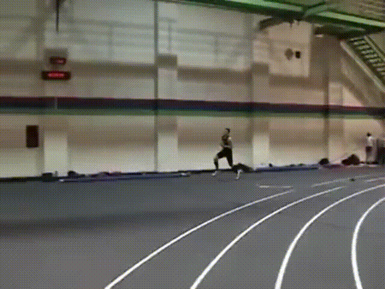
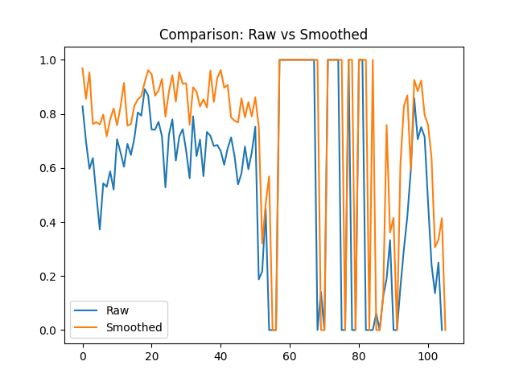
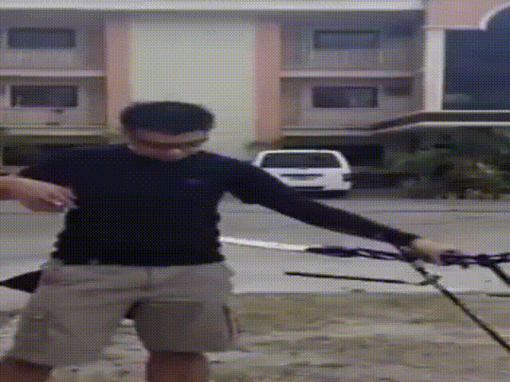
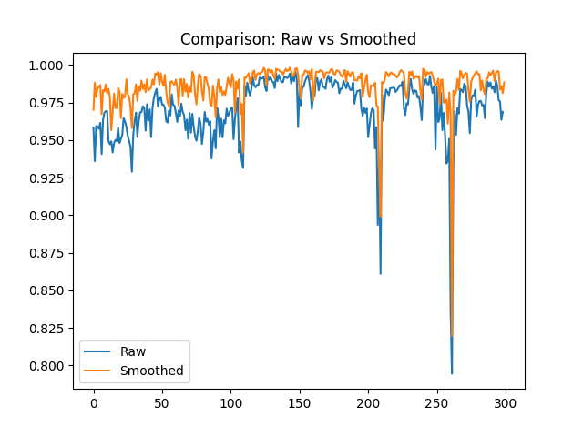

# Anti Flicker

## Описание

Является реализацией домашнего задания трека А, по стабилизации последовательности масок семантической сегментации.
В задаче сегментации модели склонны к смещениям и резким скачкам масок между кадрами, что может быть критично в некоторых задачах где нужна большая точность, вроде положения роборуки в пространстве. 

В качестве решения реализованы несколько методов, а именно: сглаживание по медиане, среднему, гаусу, а так же масок вероятностей.

В качестве модели сегментации выбрана DeepLabV3 из-за встроенного api torchvision.
## Запуск

```bash
python src/main.py \
    --video data/test.mp4 \ # путь к исходному видеофайлу
    --method gaussian \ # метод сглаживания
    --window 7 \ # размер окна
    --sigma 2 \ # параметр только для гаусовского
    --output result_gauss.mp4
```


### Ограничения метода

Метод показывает эффективность именно на ошибках сегментации, связанных со случайными небольшими смещениями при относительной стабильности объекта в пространстве.

Соответственно метод не эффективен при систематических ошибках модели, а так же резких ихменениях объекта в пространстве (см. пример).


### Анализ





Как видно пока человек двигается линейно маски неплохо обрабатываются моделью сегментации, однако в момент прыжка маска резко теряется и сглаживание не позволяет восстановить истиное движение. Однако суммарно прирост +31.94% IoU.







В данном случае человек занимает стабильное положение и модель сегментации справляется. За счет чего относительный прирост метрики от сглаживания не такой значимый  +2% IoU. Но сглаживание позволяет убрать как видно по графикам некоторые шумы и повысить стабильность сегментации вцелом.